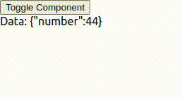

# Studying React Query under the hood

This is a simple project to study the React Query library under the hood.

## How to run

### Run the test server

```bash
cd server

pnpm install
pnpm run start
```

The server will be running on `http://localhost:3000`.

GET `http://localhost:3000` will return a a number that increases(+1) by every requests.

### Run the front-end

```bash
npm install
npm run start
```

The front-end will be running on `http://localhost:3001`. or other port if 3001 is already in use.

You can check the logic by using Toggle button.

## How to test?



check the `src/App.tsx` file and modify the `useQuery` hook to see the behavior of the React Query.

```tsx
import React from 'react';
import { QueryClient, useQuery } from '@tanstack/react-query';

const queryClient = new QueryClient();

function fetchData() {
  return fetch('http://localhost:3000').then((res) => res.text());
}

function TestComponent() {
  const { data, isFetching } = useQuery(
    {
      queryKey: ['number'],
      queryFn: fetchData,
      //refetchInterval: 1000,
      staleTime: 5000, // 5 seconds stale time
      gcTime: 10000, // 30 seconds cache time
    },
    queryClient
  );

  if (isFetching) return <div>Loading...</div>;

  return <div>Data: {data}</div>;
}

function App() {
  const [showComponent, setShowComponent] = React.useState(true);

  return (
    <div>
      <button onClick={() => setShowComponent(!showComponent)}>
        Toggle Component
      </button>
      {showComponent && <TestComponent />}
    </div>
  );
}

export default App;
```
